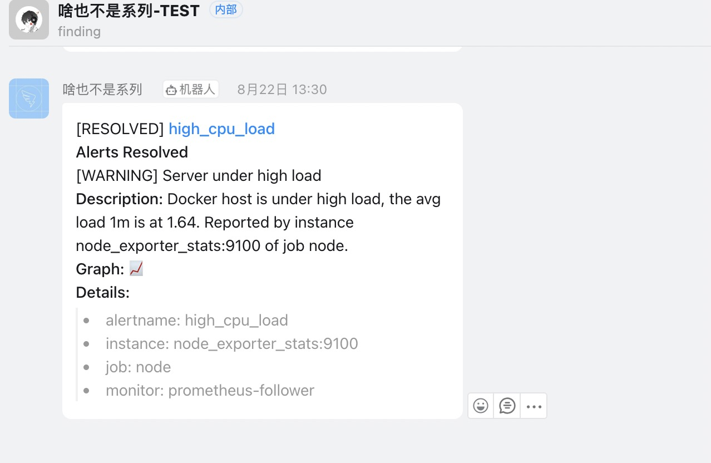

## Prometheus Federation Minimal Demo


### Requirements

- Docker, Ref「[Get Docker](https://docs.docker.com/get-docker/)」
- DingTalk WebHook AccessToken （alert）, Ref「[dingtalk-custom robot access](https://developers.dingtalk.com/document/robots/custom-robot-access)」

### Quick Start

1、get configs:

```shell
git clone https://github.com/yeshan333/prometheus-federation-minimal-demo.git
cd prometheus-federation-minimal-demo.git
```

2、edit the `configs/dingtalk/config.yml` & update the access token「your dingtalk robot」:

```yaml
targets:
  webhook1:
    url: https://oapi.dingtalk.com/robot/send?access_token=<dingtalk-robaot-access-token>
```

3、start docker service:

```shell
docker-compose up
```

4、inspect

- Grafana Leader
  - address: [localhost:3030](http://localhost:3030)
  - user: admin
  - password: admin123456
- Grafana Follower
  - address: [localhost:3031](http://localhost:3031)
  - user: admin
  - password: admin123456
- Prometheus Leader
  - ui address: [localhost:9090](http://localhost:9090)
- Prometheus Follower 1「Scrape Node Exporter」
  - ui address: [localhost:9099](http://localhost:9099)
- Prometheus Follower 2「Scrape Blackbox Exporter」
  - ui address: [localhost:9098](http://localhost:9098)
- Node Exporter: [localhost:9100](http://localhost:9100)
- Blackbox Exporter: [localhost:9115](http://localhost:9115)
- dingtalk robot: [localhost:8060](http://localhost:8060)

Have fun! Learn more details at `configs` directory.

---

Running container:

```
$ docker-compose ps
NAME                    COMMAND                  SERVICE                 STATUS              PORTS
alertmanager            "/bin/alertmanager -…"   alertmanager            running             0.0.0.0:9093->9093/tcp, :::9093->9093/tcp
blackbox_exporter       "/bin/blackbox_expor…"   blackbox_exporter       running             0.0.0.0:9115->9115/tcp, :::9115->9115/tcp
dingtalk-robot          "/bin/prometheus-web…"   dingtalk-robot          running             0.0.0.0:8060->8060/tcp, :::8060->8060/tcp
grafana_follower        "/run.sh"                grafana_follower        running             0.0.0.0:3001->3000/tcp, :::3001->3000/tcp
grafana_leader          "/run.sh"                grafana_leader          running             0.0.0.0:3000->3000/tcp, :::3000->3000/tcp
node_exporter_stats     "/bin/node_exporter"     node_exporter           running             0.0.0.0:9100->9100/tcp, :::9100->9100/tcp
prometheus-follower-1   "/bin/prometheus --c…"   prometheus-follower-1   running             0.0.0.0:9099->9090/tcp, :::9099->9090/tcp
prometheus-follower-2   "/bin/prometheus --c…"   prometheus-follower-2   running             0.0.0.0:9098->9090/tcp, :::9098->9090/tcp
prometheus-leader       "/bin/prometheus --c…"   prometheus-leader       running             0.0.0.0:9090->9090/tcp, :::9090->9090/tcp
```



